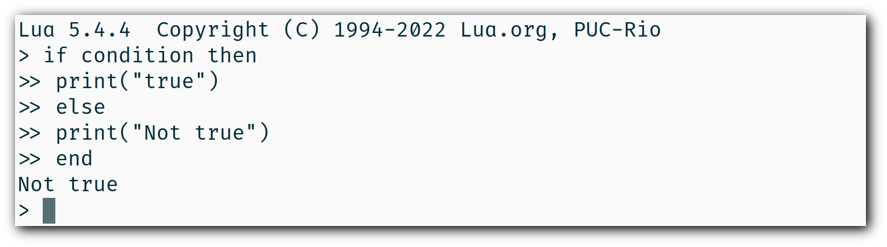

# Lua <!--{{{-->

Lua is a powerful, fast, lightweight and embeddable programming language. It is
used by many frameworks, games and other applications. While it can be used
by itself, it has been designed to be easy to embed in another application.
It is implemented in ANSI C, a subset of C programming language that is very
portable, which means it can run on many systems and many devices where the most
other scripting languages would not be able to run.

> "Lua" (pronounced LOO-ah) means "Moon" in Portuguese. As such, it is neither an
> acronym nor an abbreviation, but a noun.
> Lua comes from two languages: DEL and Sol. DEL means "Data Entry Language",
> While Sol means "Simple object language" and also means Sun in Portuguese.

One of main advantages of Lua is its simplicity. Programming which is also called
scripting in the case of programs that run inside an embedded applications, is
the process of writing computer program. A programming language is a language
used to give instructions to a computer through computer code that is contained
in a computer program. A programming language consists of two things: a syntax,
which is like grammar in English, and libraries, basic functions provided with
the language. These libraries could be compared with vocabulary in English.

### Hello World! <!--{{{-->

Lua can either be used embedded in an application or by itself.
The first example of Lua code in this book will be the basic and traditional
hello world program.

> A "Hello world" program is a computer program that outputs "Hello, world" on a
> display device. Because it is typically one of the simplest programs possible
> in most programming languages, it is by tradition often used to illustrate
> to beginners the most basic syntax of a programming language, or to verify that
> a language or system is operating correctly.

```lua
print("Hello World!")
```

The code above prints the text Hello, world! to the output.
It does so by calling the print function with the string "Hello, world!"
as an argument.

<!--}}}-->
### Syntax <!--{{{-->

The syntax of a programming language defines how statements and expressions must be
written in that programming language, just like grammar defines how sentences and words
must be written. Statements and expressions can be respectively compared to sentences and
words.

Expressions are pieces of code that have a value and that can be evaluated, while
statements are pieces of code that can be executed and that contain an instruction and one
or many expressions to use that instruction with. For example, `3 + 5` is an expression and
`variable = 3 + 5` is a statement that sets the value of variable to that expression.

<!--}}}-->
## Basics <!--{{{-->

If you are using the stand-alone Lua interpreter, all you have to do
to run your first program is to call the interpreter
—usually named `lua` or `lua5.3`/`lua5.4`—
with the name of the text file that contains your program.
If you save the *Hello World* program in a file `hello.lua`,
the following command should run it:

```
$ lua hello.lua
```

As a more complex example, the next program defines a function to compute
the factorial of a given number, asks the user for a number,
and prints its factorial:

```lua
-- defines a factorial function
function fact (n)
    if n == 0 then
        return 1
    else
        return n * fact(n - 1)
    end
end

print("enter a number:")
a = io.read("*n")       -- reads a number
print(fact(a))
```

### Chuncks <!--{{{-->

We call each piece of code that Lua executes, such as a file or a single line
in interactive mode, a *chunk*. A chunk is simply a sequence of commands
(or statements).

A chunk can be as simple as a single statement, such as in the "Hello World" example,
or it can be composed of a mix of statements and function definitions
(which are actually assignments, as we will see later), such as the factorial example.

Instead of writing your program to a file, you can run the stand-alone interpreter
in interactive mode. If you call `lua` without any arguments, you will get its prompt:

```
$ lua
Lua 5.4.4  Copyright (C) 1994-2022 Lua.org, PUC-Rio
>
```

Thereafter, each command that you type (such as `print "Hello World"`)
executes immediately after you enter it. To exit the interactive mode
and the interpreter, just type the end-of-file control character
(`ctrl-D` in POSIX, `ctrl-Z` in Windows), or call the function `os.exit`,
from the Operating System library —you have to type `os.exit()`.

Starting in version 5.4, we can enter expressions directly in the interactive mode,
and Lua will print their values:

```
$ lua
Lua 5.4.4  Copyright (C) 1994-2022 Lua.org, PUC-Rio
> math.pi / 4	--> 0.78539816339745
> a = 15
> a ^ 2			--> 225
> a + 2			--> 17
```

In older versions, we need to precede these expressions with an equals sign:

```
$ lua5.2
Lua 5.2.3  Copyright (C) 1994-2013 Lua.org, PUC-Rio
> a = 15
> = a^2			--> 225
```

For compatibility, Lua 5.4 still accepts these equals signs.

To run that code as a chunk (not in interactive mode), we must enclose
the expressions inside calls to `print`:

```lua
print(math.pi / 4)	--> 0.78539816339745
a = 15
print(a^2)			--> 225
print(a + 2)		--> 17
```

Lua usually interprets each line that we type in interactive mode as a complete
chunk or expression. However, if it detects that the line is not complete,
it waits for more input, until it has a complete chunk. This way, we can enter a
multi-line definition, such as the factorial function, directly in interactive mode.
However, it is usually more convenient to put such definitions in a file and then
call Lua to run the file.



We can use the `-i` option to instruct Lua to start an interactive session
after running a given chunk:

```
$ lua -i prog
```

A command line like this one will run the chunk in the file `prog` and then
prompt for interaction. This is especially useful for debugging and manual testing.

Another way to run chunks is with the function `dofile`, which immediately executes
a file. For instance, suppose we have a file `lib1.lua` with the following code:

```lua
function norm (x, y)
    return math.sqrt(x^2 + y^2)
end

function twice (x)
    return 2.0 * x
end
```

Then, in interactive mode, we can type this code:

```
> dofile("lib1.lua")	-- load our library
> n = norm(3.4, 1.0)
> twice(n)				--> 7.0880180586677
```

The function `dofile` is useful also when we are testing a piece of code. We can work
with two windows: one is a text editor with our program (in a file `prog.lua`, say)
and the other is a console running Lua in interactive mode. After saving a
modification in our program, we execute `dofile("prog.lua")` in the Lua console to
load the new code; then we can exercise the new code, calling its functions and
printing the results.

<!--}}}-->
### Some Lexical Conventions <!--{{{-->

Identifiers (or names) in Lua can be any string of letters, digits, and underscores,
not beginning with a digit; for instance

```lua
i		j		i10		_ij 
aSomewhatLongName		_INPUT
```

You should avoid identifiers starting with an underscore followed by one or more
upper-case letters (e.g., `_VERSION`); they are reserved for special uses in Lua.
Usually, I reserve the identifier `_` (a single underscore) for dummy variables.

The following words are reserved; we cannot use them as identifiers:

```lua
and end if or until break false in repeat while do for local
return else function nil then elseif goto not true
```

Lua is case-sensitive: `and` is a reserved word, but
`And` and `AND` are two different identifiers.

A comment starts anywhere with two consecutive hyphens (--) and runs until the end of the

<!--}}}-->
### Comments <!--{{{-->

A comment is a code annotation that is ignored by the programming language.
Comments can be used to describe one or many lines of code, to document a program,
to temporarily disable code, or for any other reason.

They need to be prefixed by
two hyphens to be recognized by Lua and they can be put either on their own line
or at the end of another line:

```lua
print("This is normal code.")
-- This is a comment
print("This is still normal code.") -- Comment at the end of a line of code.
```

These comments are called short comments. It is also possible to create long comments,
which start with a long bracket and can continue on many lines:

```lua
print("This is normal code")
--[[Line 1
Line 2
]]
```

Long brackets consist of two brackets in the middle of which any number of
equality signs may be put. That number is called the level of the long bracket.
Long brackets will continue until the next bracket of the same level, if there is one.

A long bracket with no equal sign is called a long bracket of level 0.
This approach makes it possible to use closing double brackets inside of
long comments by adding equal signs in the middle of the two brackets.
It is often useful to do this when using comments to disable blocks of code.

```lua
--[==[
This is a comment that contains a closing long bracket of level 0 which is here:
 ]]
However, the closing double bracket doesn't make the comment end, because the
  comment was opened with an opening long bracket of level 2, and only a closing
  long bracket of level 2 can close it.
]==]
```

In the example above, the closing long bracket of level 0 (`]]`) does not close the comment,
but the closing long bracket of level 2 (`]==]`) does.

> Long comments can be more complex than that, as we will see in the section called
> "Long Strings".

<!--}}}-->

Lua needs no separator between consecutive statements, but we can use a semicolon if
we wish. Line breaks play no role in Lua's syntax; for instance, the following
four chunks are all valid and equivalent:

```lua
a = 1
b = a * 2

a = 1;
b = a * 2;

a = 1; b = a * 2
a = 1 b = a * 2 -- ugly, but valid
```

<!--}}}-->
## Global Variables <!--{{{-->

Global variables do not need declarations; we simply use them. It is not an error
to access a non-initialized variable; we just get the value nil as the result:

```
> b		--> nil
> b = 10
> b		--> 10
```

If we assign nil to a global variable, Lua behaves as if we have never used the variable:

```
> b = nil
> b		--> nil
```

Lua does not differentiate a non-initialized variable from one that we assigned nil.
After the assignment, Lua can eventually reclaim the memory used by the variable.

<!--}}}-->
## Types and Values <!--{{{-->

Lua is a dynamically-typed language. There are no type definitions in the language;
each value carries its own type.

There are eight basic types in Lua:
*nil*, *Boolean*, *number*, *string*, *userdata*, *function*, *thread*, and *table*.
The function `type` gives the type name of any given value:

```
> type(nil)				--> nil
> type(true)			--> boolean
> type(10.4 * 3)		--> number
> type("Hello world")	--> string
> type(io.stdin)		--> userdata
> type(print)			--> function
> type(type)			--> function
> type({})				--> table
> type(type(X))			--> string
```

The last line will result in "`string`" no matter the value of `X`,
because the result of `type` is always a string.

The userdata type allows arbitrary C data to be stored in Lua variables.
It has no predefined operations in Lua, except assignment and equality test.
Userdata are used to represent new types created by an application program or
a library written in C; for instance, the standard I/O library uses them to
represent open files. We will discuss more about userdata later,
when we get to the C API.

Variables have no predefined types; any variable can contain values of any type:

```
> type(a)				--> nil	('a' is not initialized)
> a = 10				
> type(a)				--> number
> a = "a string!!"		
> type(a)				--> string
> a = nil				
> type(a)				--> nil
```

Usually, when we use a single variable for different types, the result is messy code.
However, sometimes the judicious use of this facility is helpful,
for instance in the use of nil to differentiate a normal return
value from an abnormal condition.

We will discuss now the simple types nil and Boolean.

### Nil <!--{{{-->

Nil is a type with a single value, nil, whose main property is to be different from
any other value. Lua uses nil as a kind of non-value, to represent the absence of a
useful value. As we have seen, a global variable has a nil value by default, before
its first assignment, and we can assign nil to a global variable to delete it.

<!--}}}-->
### Booleans <!--{{{-->

The Boolean type has two values, *false* and *true*, which represent the traditional
Boolean values. However, Booleans do not hold a monopoly of condition values: in Lua,
any value can represent a condition. Conditional tests
(e.g., conditions in control structures) consider both the Boolean **false** and nil as
false and anything else as true. In particular, Lua considers both zero and the
empty string as true in conditional tests.

Throughout this book, I will write "false" to mean any false value, that is,
the Boolean **false** or nil. When I mean specifically the Boolean value,
I will write "false". The same holds for "true" and "**true**".

Lua supports a conventional set of logical operators: **and**, **or**, and **not**.
Like control structures, all logical operators consider both the Boolean **false**
and nil as false, and anything else as true. The result of the **and** operator is
its first operand if that operand is false; otherwise, the result is its second operand.
The result of the **or** operator is its first operand if it is not false; otherwise,
the result is its second operand:

```
> 4 and 5			--> 5
> nil and 13		--> nil
> false and 13		--> false
> 0 or 5			--> 0
> false or "hi"		--> "hi"
> nil or false		--> false
```

<!--}}}-->

Both **and** and **or** use short-circuit evaluation, that is, they evaluate
their second operand only when necessary. Short-circuit evaluation ensures that
expressions like (`i ~= 0 and a/i > b`) do not cause run-time errors:
Lua will not try to evaluate `a / i` when `i` is zero.

A useful Lua idiom is `x = x or v`, which is equivalent to

```lua
if not x then x = v end
```

That is, it sets `x` to a default value `v` when `x` is not set
(provided that `x` is not set to **false**).

Another useful idiom is `((a and b) or c)` or simply `(a and b or c)`
(given that **and** has a higher precedence than **or**). It is equivalent to the C
expression `a ? b : c`, provided that `b` is not false. For instance, we can select
the maximum of two numbers `x` and `y` with the expression `(x > y) and x or y`.
When `x > y`, the first expression of the **and** is true, so the **and** results
in its second operand (`x`), which is always true (because it is a number),
and then the **or** expression results in the value of its first operand, `x`.
When `x > y` is false, the **and** expression is false and so the **or** results
in its second operand, `y`.

The not operator always gives a Boolean value:

```
> not nil		--> true
> not false		--> true
> not 0			--> false
> not not 1		--> true
> not not nil	--> false
```

<!--}}}-->
<!--}}}-->
